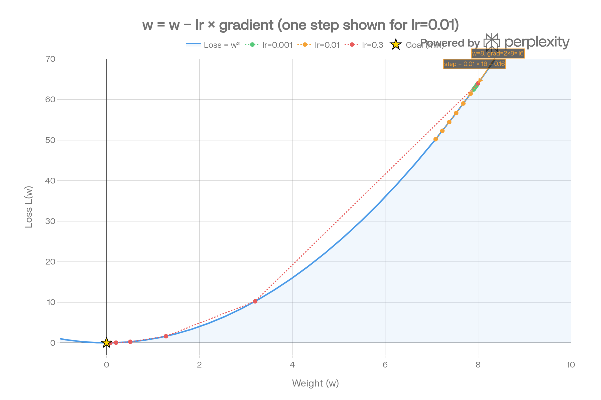

# Day 03 — Loss Functions & Gradient Descent Notes
**Date:** February 28, 2026

---

## Learning Rate Experiments

### 1. What happens with lr=0.001? (too slow?)
The loss decreases but extremely slowly — after 100 epochs it's barely moved
from the starting value. The steps are so tiny that the weights barely update
each round. The network will eventually converge but it would take thousands
of epochs to get there. Verdict: too slow for practical use.

### 2. What happens with lr=0.1? (too fast?)
The loss drops quickly at first but then starts oscillating — it overshoots
the minimum, bounces to the other side, overshoots again. It might still
converge but it's unstable and unpredictable. Close to the danger zone.

### 3. lr=1.0 — what goes wrong? This is called divergence.
With lr=1.0 the loss EXPLODES — it hit 2.6 × 10^228 in my experiment.
The step size is so large that instead of moving toward the minimum,
the weights fly past it, land somewhere worse, generate a bigger gradient,
take an even bigger step, and the loss grows without bound.
This is called DIVERGENCE — the opposite of convergence.
The network is not learning, it's falling apart.

---

## Experiment: Loss Function Behavior

### 1. Make predictions further from actual — what happens to loss?
Loss increases, and it increases fast because we square the difference.
If error doubles from 1 → 2, loss goes from 1 → 4 (4x bigger, not 2x).
This means large errors are punished disproportionately hard — which is
exactly what we want to force the network to fix its worst mistakes first.

### 2. Make predictions closer — what happens?
Loss decreases toward zero. As prediction → actual value, (pred - actual)² → 0.
The loss surface flattens near the minimum, which also means the gradient
gets smaller naturally — steps slow down as we approach the correct answer.

### 3. Why do we SQUARE the difference instead of just subtracting?
Three reasons:
- **Always positive** — without squaring, positive and negative errors cancel
  out. e.g. errors of +3 and -3 would average to 0, making it look like
  perfect predictions when they're actually both wrong.
- **Punishes large errors more** — squaring makes big mistakes much more
  costly, pushing the network to prioritize fixing the worst predictions.
- **Smooth and differentiable** — squaring gives a smooth curve we can take
  the gradient of. |error| (absolute value) has a sharp corner at 0 that
  causes problems for gradient descent.

---

## Core Concept Notes

### 1. What is a loss function in one sentence?
A loss function is a single number that measures how wrong the network's
predictions are — the higher the number, the worse the network is doing.

### 2. What does a gradient tell you?
A gradient tells you the slope of the loss surface at your current weight
value — specifically, how much the loss changes when you nudge that weight
slightly. It's the direction of steepest INCREASE in loss.

### 3. Why do we go in the OPPOSITE direction of the gradient?
Because the gradient points uphill (toward higher loss) — we want to go
downhill (toward lower loss). So we subtract the gradient:
  w = w - lr × gradient
Going opposite to the gradient = going in the direction that reduces loss fastest.
This is called gradient descent — descending the loss landscape.

### 4. What is the learning rate and what happens if it's too large or too small?
The learning rate (lr) is a scalar that controls the size of each weight
update step. It multiplies the gradient before subtracting from the weight.
- Too small (lr=0.0001): training works but takes forever — tiny steps
- Just right (lr=0.001–0.01): steady convergence, stable loss curve
- Too large (lr=1.0): divergence — loss explodes, weights go to infinity

### 5. What was the most surprising thing in the visualizations?
The most surprising thing was seeing how the gradient naturally shrinks as
you approach the minimum — even with a fixed learning rate, the steps get
smaller automatically because the slope flattens. The network has a built-in
"slow down near the answer" behavior. Also seeing lr=1.0 produce a loss of
10^228 made the abstract concept of divergence very concrete and real.

---

## Key Formulas
- MSE Loss: `L = (prediction - actual)²`
- Weight update: `w = w - lr × gradient`
- Gradient of w²: `dL/dw = 2w`
- Divergence: when loss grows unbounded instead of decreasing

---

This is a representation of how varying the learning rate affects the loss function.

