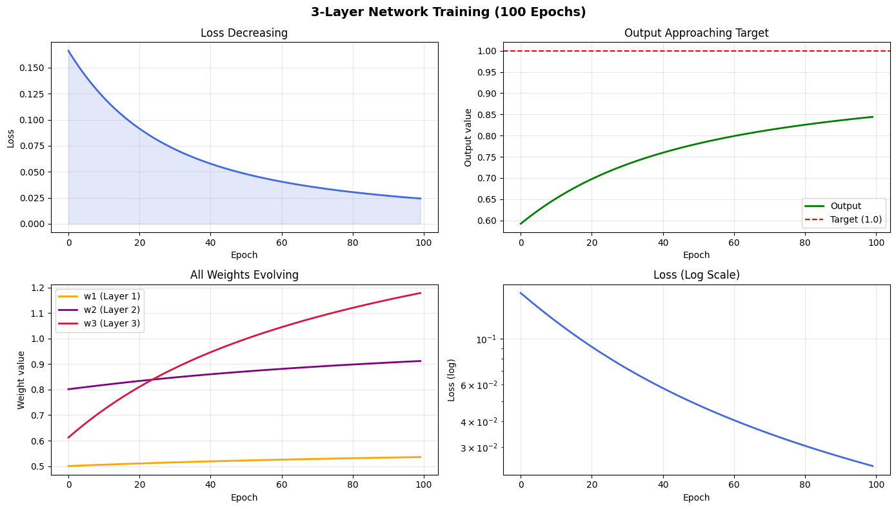

# Day 04 — Backpropagation Notes
**Date:** March 01, 2026

---

## Quick Answers

### What does each weight's gradient actually represent?
A weight's gradient represents how much the final loss changes when you
nudge that weight slightly. It's a measure of that specific weight's
responsibility for the current error. A large gradient = that weight is
heavily contributing to the mistake. A near-zero gradient = that weight
is barely affecting the output right now.

### What does it mean to "nudge" a weight?
Nudging means making a tiny adjustment to a weight in the direction that
reduces loss. The size of the nudge = learning rate × gradient.
e.g. if w1 = 0.5 and gradient = -0.033, nudge = 0.1 × -0.033 = -0.0033
so w1 becomes 0.5033. Small, deliberate, repeated — that's learning.

### Why do later layers get updated before earlier layers?
Because you literally cannot calculate an early layer's gradient without
knowing the later layers' gradients first. Each layer's blame depends on
how much the layers after it amplified that blame. You start at the output
(where you know the error) and multiply backwards — you can't skip ahead.

### What is the chain rule doing visually?
It's tracing a domino chain of cause and effect from the final loss all
the way back to the first weight. Each step multiplies the previous
blame by one more "how much did this affect the next thing" factor.
Visually: blame starts big at the output, and each gate (sigmoid
derivative) and weight it passes through either shrinks or scales it
as it travels backwards through the network.

---

## Core Notes

### 1. What is backpropagation in one sentence — no jargon?
Backpropagation is the process of measuring how wrong the network's
output was, then tracing that wrongness backwards through every layer
to figure out how much each weight contributed, so each weight can be
adjusted by exactly the right amount.

### 2. What is the chain rule doing in your own words?
The chain rule is answering: "If I change weight W1 slightly, how does
that ripple all the way to the final loss?" Since the output depends on
z2, which depends on a1, which depends on z1, which depends on w1 —
the chain rule says: multiply all those rates of change together.
It's like asking how much moving the first domino moves the last one —
you multiply each domino's knock-on effect down the chain.

### 3. Why do we compute the backward pass in reverse order?
Because each layer's gradient is built FROM the next layer's gradient.
dL/dw1 needs dL/dz1, which needs dL/da1, which needs dL/dz2, which
needs dL/doutput. You must have each answer before you can calculate
the one before it — like solving a chain of dependencies backwards.
Output layer first, input layer last — always.

### 4. What is sigmoid_derivative and why does sigmoid have a clean derivative?
sigmoid_derivative(x) = sigmoid(x) * (1 - sigmoid(x))
It tells you how open the sigmoid "gate" was at that point — how much
gradient is allowed to flow back through that neuron.
Sigmoid has a clean derivative because its mathematical form (1/(1+e^-x))
simplifies beautifully when differentiated — the result is just
output * (1 - output). No complex formula needed, just use the value
you already computed in the forward pass. That's computationally elegant.

### 5. What would break if you skipped backprop and just updated the output layer?
Only w3 (and b3) would ever change. w1 and w2 would stay at their
initial random values forever, no matter how many epochs you ran.
The hidden layers would never learn — they'd just be random transformers
passing garbage to the output layer. The output layer can't compensate
for bad hidden representations on its own. The network would fail to
learn anything meaningful beyond the simplest patterns.

---

## Key Inference — Vanishing Gradient Proven Experimentally

This was observed directly from the 3-layer network training plot (100 epochs):

### What the weights plot showed:

- w3 (Layer 3): 0.61 → 1.18 ← moved the MOST
- w2 (Layer 2): 0.80 → 0.91 ← moved moderately
- w1 (Layer 1): 0.50 → 0.54 ← moved the LEAST

### Why this happened:
By the time blame travels from the output back to w1, it has been
multiplied by THREE sigmoid derivatives — each one between 0 and 0.25.
e.g. 0.235 × 0.235 × 0.235 ≈ 0.013 — barely 1.3% of the original signal.
w3 gets full gradients. w1 gets crumbs.

### Why this matters:
This is the **vanishing gradient problem** — the reason deep sigmoid
networks barely learned anything before 2012. Earlier layers get
negligible updates, so they never learn meaningful representations.

### The fix (coming Day 6-7):
ReLU activation: derivative is either 0 or 1 — no squishing.
Gradients flow back without shrinking, all layers update at similar rates.
This single change enabled training of truly deep networks (10, 50, 100+ layers).

---

## Key Formulas
- Backprop chain: `dL/dw = dL/dz × dz/dw`
- Sigmoid derivative: `σ'(x) = σ(x) × (1 - σ(x))`  → range: 0 to 0.25
- Weight update: `w = w - lr × dL/dw`
- Vanishing factor per layer: `~0.235 × 0.235 ≈ 0.055` per 2 layers
