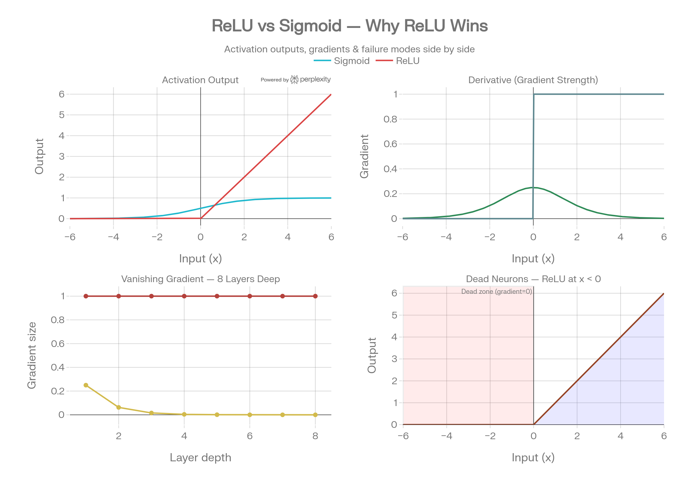

# Day 07 Notes — MNIST, DataLoaders, Dropout & Deep Networks

## ReLU vs Sigmoid — Why ReLU Wins

---

## The Core Formulas

```python
# Sigmoid
sigmoid(x) = 1 / (1 + e^(-x))       # output range: (0, 1)

# ReLU
relu(x) = max(0, x)                  # output range: (0, ∞)
``` 

## Panel 1 — Activation Output
ReLU is dead simple:

```
x < 0  →  output = 0        (off, ignore this signal)
x > 0  →  output = x        (pass through unchanged)
```
Sigmoid squashes everything into (0, 1) — no matter how large or small the input, the output is trapped between 0 and 1.

ReLU has no ceiling for positive values.

## Panel 2 — Derivative (Gradient Strength)
The derivative is what gets multiplied at every layer during backprop.


Sigmoid derivative  =  sigmoid(x) * (1 - sigmoid(x))
                     → MAX value is 0.25 (only at x=0)
                     → everywhere else it's even smaller

ReLU derivative     =  1  for x > 0
                     =  0  for x < 0
                     → always 1 for active neurons, never shrinks

## Panel 3 — Vanishing Gradient Across Layers
This is where Sigmoid breaks in deep networks.
Each layer multiplies the gradient by at most 0.25:

After 1 layer:   0.25^1 = 0.25
After 3 layers:  0.25^3 = 0.016
After 5 layers:  0.25^5 = 0.001
After 8 layers:  0.25^8 = 0.000015  ← basically zero, nothing learned

ReLU gradient stays at 1.0 all the way through every layer.
Early layers in a deep Sigmoid network simply stop learning —
they receive no gradient signal at all.

This is called the Vanishing Gradient Problem — one of the
main reasons deep networks were nearly impossible before ReLU.

## Panel 4 — ReLU's One Weakness: Dead Neurons
For any input < 0, ReLU outputs exactly 0 AND gradient = 0.

If a neuron gets stuck receiving only negative inputs:
Output = 0 forever
Gradient = 0 forever
Neuron permanently stops learning ← called a "dead neuron"

```
x = -5  →  relu(-5) = 0  →  gradient = 0  →  weight never updates
```

How to avoid it:

Don't use too high a learning rate (kills neurons on big updates)

Use Leaky ReLU → outputs 0.01x instead of 0 for negative inputs
so the gradient is tiny but never fully zero



## Side by Side Summary

| Sigmoid | ReLU |
| --- | --- |
| Output range | (0, 1) — always squashed | (0, ∞) — no ceiling |
| Max gradient | 0.25 | 1.0 |
| Deep networks | ❌ Gradient vanishes | ✅ Gradient stays strong |
| Computation | Expensive (exponential) | Cheap (just a max) |
| Weakness | Vanishing gradients | Dead neurons |
| Best for | Output layer (binary) | Hidden layers (all depths) |

---

### 1. What is a DataLoader and why not just load all data at once?

A DataLoader cuts your dataset into mini-batches and feeds them
one batch at a time during training.

**Why not load everything at once:**
- MNIST has 60,000 images — loading all at once eats your RAM
- You'd get only 1 gradient update per epoch (very slow learning)
- DataLoader gives you 937 updates per epoch (60,000 ÷ 64)

```python
train_loader = DataLoader(train_dataset, batch_size=64, shuffle=True)
# 60,000 images ÷ 64 per batch = 937 gradient updates per epoch
```

Key arguments:
| Argument | What it does |
|---|---|
| `batch_size=64` | How many images per batch |
| `shuffle=True` | Randomise order every epoch (training only) |
| `shuffle=False` | Keep order fixed (evaluation only) |

---

### 2. Why `nn.Flatten()` before the linear layers?

Each MNIST image arrives as a 3D block:
```
Single image:  (1, 28, 28)   ← 1 channel × 28 rows × 28 cols
Batch of 64:   (64, 1, 28, 28)
```

`nn.Linear` expects a flat 1D row of numbers per sample, not a 3D block.
`nn.Flatten()` squashes the spatial dimensions into one row:

```
(64, 1, 28, 28)  →  nn.Flatten()  →  (64, 784)
                                            ↑
                                    1 × 28 × 28 = 784 pixel values
```

Without `nn.Flatten()` the shapes won't align and PyTorch throws a
dimension mismatch error.

---

### 3. Why ReLU instead of Sigmoid in this network?

**The vanishing gradient problem kills Sigmoid in deep networks:**

Sigmoid's max derivative = 0.25. Every layer multiplies the gradient
by at most 0.25 during backprop:

```
After 1 layer:  0.25^1 = 0.25
After 3 layers: 0.25^3 = 0.016
After 5 layers: 0.25^5 = 0.001
After 8 layers: 0.25^8 = 0.000015  ← gradient essentially zero
```

Early layers receive no signal and stop learning entirely.

**ReLU fixes this:**
```python
relu(x) = max(0, x)
# derivative = 1 for all positive inputs — never shrinks
```

Gradient stays 1.0 all the way through every layer.
The only trade-off is dead neurons (x < 0 → output = 0, gradient = 0).

**Rule:**
```
Hidden layers  →  ReLU   (gradient stays healthy)
Output layer   →  None   (raw logits for CrossEntropyLoss)
```

---

### 4. What does Dropout do and why does it help?

```python
nn.Dropout(0.2)   # randomly turns OFF 20% of neurons each forward pass
```

During training, Dropout randomly sets 20% of neuron outputs to 0
on every single forward pass. A different random 20% each time.

**Why this helps:**
The network can't rely on any single neuron always being there.
It's forced to learn **redundant, distributed representations** —
the same feature gets learned by multiple neurons, not just one.

```
Without Dropout:  network memorises training data → overfitting
With Dropout:     network learns robust patterns  → generalises better
```

During `model.eval()`, Dropout is automatically turned OFF —
all neurons are active and outputs are scaled to compensate.

> Your train/test gap was only 0.15% (97.83% train vs 97.68% test)
> — Dropout working exactly as intended.

---

### 5. What test accuracy did you get? Which digit was hardest?

**Overall Test Accuracy: 97.68%** on 10,000 unseen images.

Per-digit breakdown:
```
Digit 0: 99.2%  ← easiest  (very distinct circular shape)
Digit 1: 98.9%
Digit 2: 98.1%
Digit 3: 97.7%
Digit 4: 98.0%
Digit 5: 97.5%
Digit 6: 98.5%
Digit 7: 95.5%  ← hardest  (confused with 1)
Digit 8: 97.3%
Digit 9: 95.9%  ← 2nd hardest  (confused with 4 or 7)
```

Digits 7 and 9 were hardest — expected, as they visually overlap
with other digits especially in messy handwriting.

---

## Architecture Used

```python
class MNISTClassifier(nn.Module):
    def __init__(self):
        super(MNISTClassifier, self).__init__()
        self.network = nn.Sequential(
            nn.Flatten(),           # (64,1,28,28) → (64,784)
            nn.Linear(784, 128),    # 784 inputs → 128 hidden
            nn.ReLU(),
            nn.Dropout(0.2),        # drop 20% randomly
            nn.Linear(128, 64),     # 128 → 64 hidden
            nn.ReLU(),
            nn.Dropout(0.2),
            nn.Linear(64, 10)       # 64 → 10 classes (digits 0-9)
        )

    def forward(self, x):
        return self.network(x)
```

Total parameters: **109,386**

---

## Training Loop Structure — New in Day 7

```python
for epoch in range(epochs):                          # outer — full passes
    for batch_idx, (images, labels) in enumerate(train_loader):  # inner — batches
        images, labels = images.to(device), labels.to(device)

        outputs = model(images)
        loss    = criterion(outputs, labels)

        optimizer.zero_grad()
        loss.backward()
        optimizer.step()

        # Progress logging — only reason batch_idx exists
        if batch_idx % 100 == 0:
            print(f"Batch {batch_idx}/937...")
```

**Epochs vs Iterations:**
```
1 iteration = 1 forward+backward on 1 batch (64 images)
1 epoch     = all 937 iterations (60,000 images seen once)
```

---

## Bugs from Today

```python
# Bug 1 — Missing () on super()
super(MNISTClassifier, self).__init__    # ❌ just a reference, never called
super(MNISTClassifier, self).__init__()  # ✅ actually runs it
```

---

## 📌 Vocab Quick Reference

| Term | Meaning |
|------|---------|
| DataLoader | Batches the dataset, feeds one batch at a time |
| `batch_size` | How many samples per batch |
| `shuffle=True` | Randomise batch order every epoch |
| `nn.Flatten()` | Squash 3D image tensor into 1D flat vector |
| Dropout | Randomly turns off neurons during training to prevent overfitting |
| `batch_idx` | Which batch number you're on — for progress logging only |
| `enumerate()` | Gives index + value when looping |
| `zip()` | Pairs two lists element by element |
| `state_dict()` | Dictionary of all learned weights and biases |
| `os.makedirs()` | Create a folder (use `exist_ok=True` to be safe) |
| Dead neuron | ReLU neuron stuck at 0 — permanently stops learning |
| Vanishing gradient | Gradients shrink to near-zero in deep Sigmoid networks |

